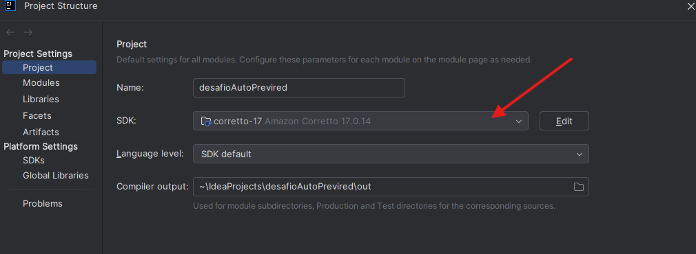
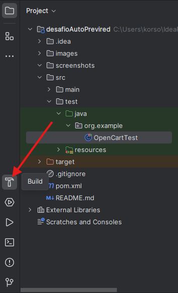
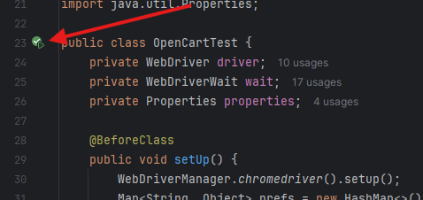

# OpenCart Automation - Selenium Test Suite

## Autor

**Nombre:** Marcos Medina  
**Fecha:** Abril 2025

## Descripción
Test automatizado de OpenCart utilizando Selenium WebDriver con TestNG. El código realiza pruebas de extremo a extremo sobre la funcionalidad del carrito de compras, incluyendo:

- Búsqueda y agregado de productos al carrito.
- Visualización del carrito y validación de los productos.
- Inicio de sesión
- Registro de usuario.
- Proceso de compra completo (Checkout).
- Verificación del historial de pedidos.
- LogOut
- Comparacion de productos

## Tecnologías utilizadas
- Intellij IDEA
- Java (JDK 17)
- Selenium WebDriver
- TestNG
- WebDriverManager

## Estructura del código

```plaintext
src/test/java/org/example
 ┣ OpenCartTest.java      # Código principal del test automatizado
 ┣ resources
 ┃ ┗ credentials.properties  # Archivo con las credenciales de login
screenshots              # Directorio donde se guardan las capturas de pantalla
images                   # imagenes de apoyo visual

```

## Pre-requisitos

Antes de ejecutar el test, asegúrate de tener:
1. Instalar Intellij IDEA
2. JDK 17 o superior instalado o configurado en el mismo IDEA.
   
3. Maven configurado para gestionar las dependencias.
4. Chrome y WebDriverManager instalados.

## Configuración

1. Con Intellij puedes clonar el repositorio directamente.

2. Ya descargado el codigo Intellij automaticamente empesara a descargar las dependencias sino dale al boton BUILD.
   

## Como ejecutar test

1. Desde el mismo IDE al costado de la clase "OpenCartTest" aparecera un boton "Play" verde, click y empezara a realizar las pruebas.

   
2. O si bien desde la consola o terminal ejecutar el comando
```
mvn clean test
```
## Casos de prueba

### Test 1: Agregar productos al carrito
- Búsqueda y adición de productos (`iPod Classic` e `iMac`).
- Captura de pantalla después de agregar productos.

### Test 2: Ver carrito y validar productos
- Abrir el carrito y verificar productos agregados.

### Test 3: Inicio de sesión y registro
- Inicio de sesión con credenciales almacenadas.

### Test 4: Proceso de compra
- Selección del país y estado con `Select` de Selenium.
- Validación del método de envío (`Flat Shipping Rate - $5.00`).
- Verificación del total del pedido antes del pago.

### Test 5: Verificación del historial de pedidos
- Confirmación del pedido.
- Verificación del estado del pedido en `"Pending"`.

### Test 6: Registro de Usuario
- Registro si el usuario no está registrado.

### Test 7: Comparacion de productos
- Compara los productos (`Apple Cinema 30" y Samsung SyncMaster 941BW`).

